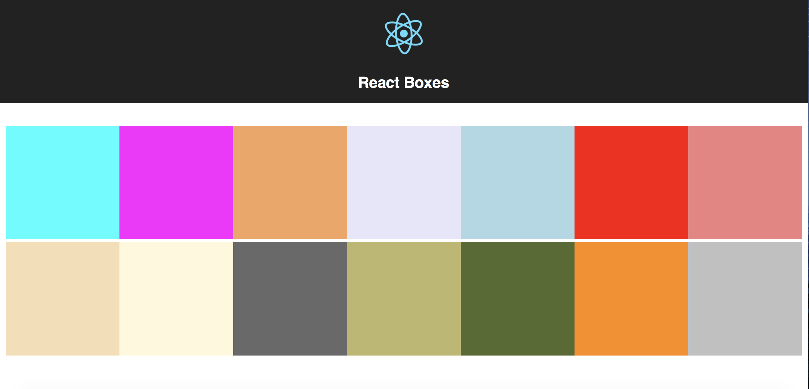

# React-Boxes
A React application developed with changing states causing a box component every few seconds

Technologies: React, Babel, JSX, Webpack, React Components and States

Link : https://react-boxes.herokuapp.com/

